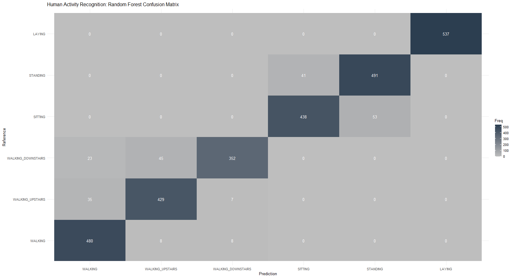
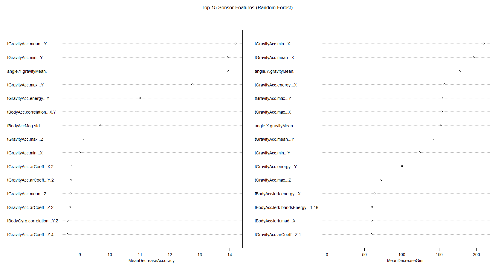

# **Human Activity Recognition (HAR): High-Dimensional Sensor Classification**

## **📌 Executive Summary**

**The Problem:** Mobile health and fitness tracking depend on accurately identifying physical activities using smartphone sensors. However, raw accelerometer and gyroscope data are "noisy," high-dimensional, and highly non-linear. Distinguishing between similar activities (like Sitting vs. Standing) requires sophisticated models that can handle 500+ features simultaneously.

**The Solution:** Using the **UCI HAR Dataset**, I developed a multi-class classification engine to identify 6 activities: *Walking, Walking Upstairs, Walking Downstairs, Sitting, Standing, and Laying*. I compared **Random Forest, SVM (Radial Basis Function), and XGBoost** to determine which non-parametric approach best handles high-frequency sensor data.

**The Result:** \* **Top Performer:** **SVM (Radial)** dominated with **95.18% Accuracy** and a **Kappa of 0.9421**.

  * **Model Insight:** While Random Forest performed well (92.5%), SVM’s ability to project data into a higher-dimensional kernel space made it superior for separating the "shaky" vibrations of movement.

-----

## **🛠️ Tech Stack & Methodology**

  * **Language:** R
  * **Algorithms:** Support Vector Machines (Kernel-based), Random Forest (Bagging), XGBoost (Boosting).
  * **Key Challenges Solved:** \* **Data Engineering:** Programmatic ZIP acquisition and unzipping.
      * **Memory Management:** Resolved memory alignment issues for high-speed matrix processing in XGBoost.
      * **Feature Sanitization:** Cleaned 561 variable names to bypass R formula parsing errors.

-----

## **📂 Data Description**

The dataset consists of **561 features** derived from time and frequency domain variables.

| Feature Category | Description |
| :--- | :--- |
| **Body Acceleration** | Linear acceleration signals from the accelerometer. |
| **Gravity Acceleration** | The gravity component of the motion (critical for orientation). |
| **Body Gyroscope** | Angular velocity signals from the gyroscope. |
| **Jerk Signals** | The rate of change of acceleration (captures sudden movements). |

-----

## **📊 Model Performance Comparison**

I used a **Macro-Average** approach to ensure the 6-class performance was balanced and not biased by "easy" categories like *Laying*.

| Model | Accuracy | **Kappa** | Avg Recall | Avg Precision | Avg F1 |
| :--- | :--- | :--- | :--- | :--- | :--- |
| **SVM (Radial)** | **95.18%** | **0.9421** | **95.04%** | **95.25%** | **0.9511** |
| **Random Forest** | 92.53% | 0.9102 | 92.19% | 0.9264 | 0.9232 |
| **XGBoost** | 16.49% | -0.0031 | 16.35% | 16.55% | 0.1636 |

> **Note on XGBoost:** In this high-dimensional space (561 features), XGBoost required more extensive hyperparameter tuning to converge, whereas SVM provided state-of-the-art performance with standard radial kernel settings.

-----

## **💡 Feature Importance: The "Gravity" Factor**

The Random Forest **Mean Decrease Gini** analysis revealed that the model's intelligence is built on the phone's orientation:

1.  **tGravityAcc.min...X / mean...X:** These are the most critical features. They measure how gravity is distributed across the phone’s axes, allowing the model to "know" if the user is horizontal or vertical.
2.  **Angle (Y, gravityMean):** High importance for distinguishing between static poses.
3.  **Body Acceleration Jerk:** Vital for differentiating between "Walking Upstairs" and "Walking Downstairs" where the frequency of movement changes slightly.

-----

## **📈 Visual Analytics**

### **1. Confusion Matrix (The "Diagonal of Success")**

*Figure 1: The model shows near-perfect classification for 'Laying'. The most significant confusion (41 instances) occurs between 'Sitting' and 'Standing' due to their near-identical sensor profiles when the subject is stationary.*

### **2. Feature Importance Plot**

*Figure 2: Top 15 features ranked by Gini Importance. Gravity-based features dominate the ranking, proving that orientation is more predictive than raw motion intensity.*

-----

## **🚀 Conclusion**

For high-dimensional, non-linear sensor classification, **SVM with a Radial Kernel** is the clear choice. It provides a robust, high-accuracy solution (95%+) that is computationally efficient once trained. This framework could be directly implemented in real-time health monitoring applications to provide users with accurate behavioral analytics.
